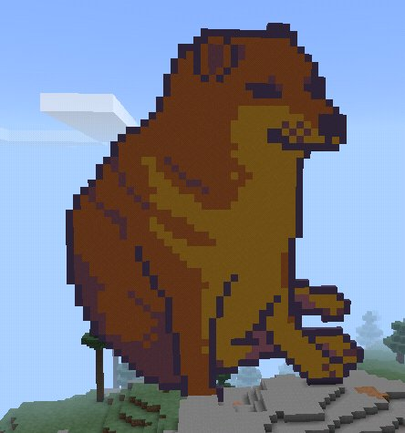
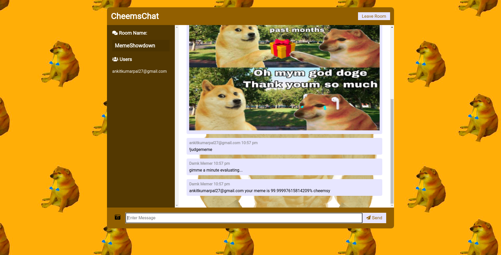

# CheemsChat

## Check out the hosted link on heroku (might not work all the time cause free tier)

https://cheems-or-not.herokuapp.com/

This is a Chat app with two rooms (Memeshowdown and General)

- General is a regular chat channel where you can text and
  upload images with other clients.

- Memeshowdown is the same as General but with a bot that
  tells you how cheemsy you're meme is.

# This is What a Cheems Meme is

## FrontEnd

- Made with vanilla javascript
- Image detection using Tensorflow.js
- Responsive design(viewable in both mobile and desktop browser)

  ### Code Structure

  - main.js => major site logic
  - predict.js => tensorflow.js model execution happens here
  - render.js => renders the text and image messages
  - utilfunc => some helper functions used by frontend
  - style.css => since there are only two pages this has all the styling
  - tfjsmodel/ => contains the model and the pretrained weights

After an image is uploaded and !judgememe is entered the bot runs the tensorflow.js
model and returns a %ge confidence in whether it is a "cheems" meme or not.

I used Azure's service called computer vision .ai to get the model imported as tensorflow.js.
I want to make my own model's with tf.js in the future cause it's just so cool.

## Backend

- Node.js server using Express
- Socket.io used for Realtime Chat

  ### Code Structure

  - server.js => major site logic
  - utils => contains formaters for messages

# Images Of the Site

# Setting up dev environment (incase you want to contribute or just use it)

- make sure to have node --version 10 or above
- git clone https://github.com/ankitpal1029/CheemsChat.git
- cd CheemsChat
- npm install -g nodemon (or) npm install nodemon --save-dev
- npm run dev
